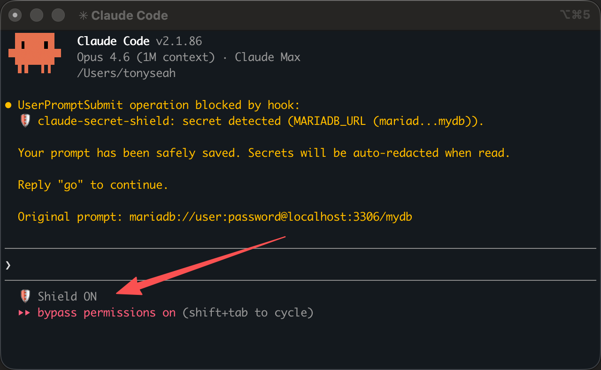

[English](README.md) | [中文](README.zh-CN.md)

# Claude Secret Shield

> Protect your secrets when using Claude Code. Automatic detection, redaction, and restoration of API keys, tokens, passwords, and credentials.

If you find this useful, please give it a star to help others discover it.

[](https://github.com/tokligence/claude-secret-shield)



## Install

```bash
curl -fsSL https://raw.githubusercontent.com/tokligence/claude-secret-shield/main/install.sh | sh
```

Restart Claude Code after installing. **Prerequisites:** Python 3.6+, `jq`. Optional: `pip3 install cryptography` for encrypted mapping storage.

## Features

- **164 secret patterns** -- OpenAI, Anthropic, AWS, GitHub, Stripe, Slack, database URLs, private keys, JWTs, and 90+ more
- **36+ blocked file types** -- `.env`, `credentials.json`, `id_rsa`, `.pem`, `.p12`, `.pfx`, and more
- **Prompt scanning** -- blocks secrets pasted directly in user prompts before they reach the API
- **Automatic restore** -- secrets restored to real values when Claude writes code
- **Auto-gitignore** -- `.tmp_secrets.conf` automatically added to `.gitignore` on first read
- **Global persistent mapping** -- same secret always produces the same placeholder, across sessions
- **Encrypted at rest** -- mapping file encrypted with Fernet (AES-128-CBC + HMAC-SHA256)
- **Parallel-safe** -- `fcntl` file locking for concurrent hook invocations
- **Bash command protection** -- blocks `cat .env`, redacts secrets in command output
- **Allowlist** -- `.claude-redact-ignore` to skip specific files
- **Binary file detection** -- skips non-text files automatically
- **Atomic writes** -- tempfile + rename prevents file corruption on crash
- **Crash recovery** -- orphaned backups automatically restored on next invocation
- **Debug mode** -- `REDACT_DEBUG=1` for troubleshooting
- **245 E2E tests** -- comprehensive test coverage

## How It Works

Four strategies work together to keep your secrets safe:

```
  User Prompt                    Your Code Files
       |                               |
       v                 +-------------+-------------+
   Layer 0               |             |             |
  SCAN PROMPT       Layer 1       Layer 2       Layer 3
  block if          BLOCK IT     REPLACE IT    RESTORE IT
  secret found           |             |             |
       |                 v             v             v
       v          Dangerous files  Secrets in    Placeholders
  "Message        denied outright  any file      swapped back
   blocked"       (.env, id_rsa,   swapped with  to real values
                   credentials...) {{PLACEHOLDER}} when writing
```

**Layer 0 -- Prompt Scanning:** When you paste a secret directly in your prompt,
the hook detects it, saves your full prompt to `.tmp_secrets.conf`, and blocks
the message. Just type: `read .tmp_secrets.conf and follow the instructions in it`.
Claude reads the file with secrets auto-redacted, and the file is auto-deleted after reading.

**Layer 1 -- Block List:** Some files should never be read at all. When Claude tries
to read `.env`, `credentials.json`, `id_rsa`, or any of the 36 blocked file types,
the hook denies the read entirely. Claude gets an error message suggesting alternatives.

**Layer 2 -- Pattern Redaction:** For every other file, the hook scans the content
against 164 regex patterns. Any match is replaced with a deterministic placeholder
like `{{OPENAI_KEY_a1b2c3d4}}`. Claude sees the placeholder, never the real key.

**Layer 3 -- Auto Restore:** When Claude writes or edits a file, the hook
silently swaps all placeholders back to the real secret values. Your code on disk
always has real credentials. Claude never knows the difference.

## Quick Start

### Install (one command)

```bash
git clone https://github.com/tokligence/claude-secret-shield.git /tmp/claude-redact-install && bash /tmp/claude-redact-install/install.sh && rm -rf /tmp/claude-redact-install
```

Or tell Claude Code: *"Install secret redaction from https://github.com/tokligence/claude-secret-shield"*

Restart Claude Code after installing.

**Prerequisites:** Python 3.6+, `jq`

**Recommended:** Install `cryptography` for encrypted mapping storage:

```bash
pip3 install cryptography
```

Without it, the mapping file is stored as plaintext (permission-restricted but not encrypted).

### Uninstall

```bash
git clone https://github.com/tokligence/claude-secret-shield.git /tmp/claude-redact-install && bash /tmp/claude-redact-install/uninstall.sh && rm -rf /tmp/claude-redact-install
```

### Verify it works

1. Create a test file with a fake secret:
   ```bash
   echo 'OPENAI_API_KEY=sk-proj-EXAMPLE-NOT-A-REAL-KEY-12345678901234' > /tmp/test-secret.txt
   ```
2. In Claude Code, ask: "Read /tmp/test-secret.txt"
3. Claude should see something like: `OPENAI_API_KEY={{OPENAI_KEY_a1b2c3d4}}`
4. The real file on disk is unchanged (check with `cat /tmp/test-secret.txt`)

## Architecture

### Hook Lifecycle

The hook registers for four Claude Code events:

| Hook Event | Tools Matched | Purpose |
|------------|---------------|---------|
| `UserPromptSubmit` | (all prompts) | Scan user input for secrets, block if found |
| `PreToolUse` | Read, Write, Edit, Bash | Intercept before execution |
| `PostToolUse` | Read, Write, Edit | Restore/cleanup after execution |
| `SessionEnd` | (all) | Clean up temporary backup files |

### Request Flow

```
User submits prompt
        |
        v
  UserPromptSubmit Hook
        |
  Secret found? ──yes──> auto-save prompt to .tmp_secrets.conf + BLOCK
        |
       no
        v
Claude Code issues tool call (Read / Write / Edit / Bash)
        |
        v
  PreToolUse Hook
        |
  +-----+--------+--------+--------+
  |              |          |          |
  v              v          v          v
 Read          Write      Edit       Bash
  |              |          |          |
  v              v          v          v
 Blocked?      Load       Load      Blocked?
 (deny)        mapping    mapping   (deny cmd)
  |              |          |          |
  v              v          v          v
 Scan for      Restore    Re-redact  Restore
 secrets,      place-     file for   place-
 backup +      holders    freshness  holders
 redact        in content check      in cmd
  |              |          |          |
  v              v          v          v
 allow         allow +    allow      allow +
               update               update
        |
        v
  Claude Code executes the tool
        |
        v
  PostToolUse Hook
        |
  +-----+--------+--------+
  |              |          |
  v              v          v
 Read          Write      Edit
 restore       cleanup    restore
 original      backup     placeholders
 from backup              in edited file
        |
        v
  SessionEnd Hook (on exit)
        |
        v
  Delete /tmp backup directory
  (mapping file preserved)
```

### The Read Flow (Core Mechanism)

This is the key design insight. Claude Code internally tracks which files it has "read."
If a Read is denied or redirected, Claude cannot Write or Edit that file later (it fails
with "file has not been read yet"). The solution:

1. `PreToolUse` fires for `Read(/path/to/config.py)`
2. Hook reads the file, scans against 140 patterns
3. Hook backs up the original to `/tmp/.claude-backup-{session}/`
4. Hook overwrites the file in-place with redacted content (preserving timestamps)
5. Hook exits 0 (allow) -- Claude reads the redacted file normally
6. Claude Code registers the file path as "read" (this is the key part)
7. `PostToolUse` fires -- hook restores the original from backup

Result: Claude saw redacted content. The real file is untouched. Claude can now Write/Edit the file.

### Crash Recovery

If Claude Code crashes between PreToolUse (file overwritten with redacted content)
and PostToolUse (original restored), the backup remains on disk. On the next hook
invocation, `restore_pending_backups()` runs at startup and restores any orphaned
backups automatically. No manual intervention needed.

## Secret Patterns

For the complete pattern catalog with prefixes, examples, and selection criteria, see [docs/PATTERNS.md](docs/PATTERNS.md).


140 patterns organized by category:

| Category | Count | Examples |
|----------|------:|---------|
| AI / ML Providers | 12 | OpenAI, Anthropic, Groq, Perplexity, Hugging Face, Replicate, DeepSeek, GCP/Gemini |
| Cloud Providers | 9 | AWS (access key, secret, session token), Azure, DigitalOcean, Alibaba Cloud, Tencent |
| DevOps / CI-CD | 28 | GitHub (6 token types), GitLab (5), Bitbucket, npm, PyPI, Docker Hub, Terraform, Vault, Grafana, Pulumi, Linear |
| Payment Processors | 10 | Stripe (4 key types), Square, PayPal/Braintree, Adyen, Flutterwave |
| Communication | 13 | Slack (4 token types), Discord, Twilio, SendGrid, Mailchimp, Mailgun, Telegram, Teams |
| Database / Storage | 26 | PostgreSQL, MySQL, MariaDB, MSSQL, Oracle, MongoDB, Redis, Cassandra, Neo4j, CouchDB, ArangoDB, ClickHouse, Snowflake, Redshift, DB2, HANA, Firebird, CockroachDB, TiDB, Databricks, and more |
| Analytics / Monitoring | 5 | New Relic, Sentry, Dynatrace |
| Auth Providers | 2 | 1Password, Age encryption |
| Other Services | 16 | Shopify, HubSpot, Postman, JFrog, Duffel, Typeform, EasyPost, and more |
| Message Queues | 4 | AMQP/RabbitMQ, NATS, MQTT, STOMP |
| Network / Auth | 3 | FTP/SFTP, LDAP/LDAPS, HTTP Basic Auth |
| Git Credentials | 3 | GitHub/GitLab/generic URLs with embedded tokens |
| Private Keys / Tokens | 2 | PEM private key blocks, JWT tokens |
| Generic Patterns | 3 | `api_key=...`, `password=...`, base64 secrets in env-like contexts |
| **Total** | **164** | |

## Security Scope

### What this tool IS

This is a **Claude Code hook** that prevents Claude from **seeing** your real secrets. When Claude reads your files, it sees `{{OPENAI_KEY_a1b2c3d4}}` instead of your actual API key. When Claude writes code, the placeholders are silently restored to real values.

### What this tool protects against

| Threat | Protected? | How |
|--------|-----------|-----|
| Claude seeing your API keys in code | Yes | Pattern-based redaction (164 patterns) |
| Claude reading .env / credentials files | Yes | File blocking (30 file types) |
| Claude seeing database passwords in connection strings | Yes | Pattern matching (MongoDB, PostgreSQL, MySQL, Redis URLs) |
| Claude seeing private keys (RSA, Ed25519, etc.) | Yes | PEM header detection + file blocking |
| Secrets pasted directly in prompts | Yes | UserPromptSubmit hook scans and blocks before API |
| `.tmp_secrets.conf` accidentally committed | Yes | Auto-added to `.gitignore` on first read |
| Mapping file stolen from your disk | Yes | Fernet encryption at rest |
| Same secret getting different placeholders | Yes | HMAC-based deterministic mapping |

### What this tool does NOT protect against

| Threat | Protected? | Why |
|--------|-----------|-----|
| Claude running arbitrary code to read .env | **No** | Bash regex blocking is best-effort, not bulletproof |
| Claude using `python3 -c "open('.env').read()"` | **No** | Infinite ways to read a file programmatically |
| Secrets printed in Bash command output | **Partial** | Redacted in known patterns, but not all output |
| Root user reading your files | **No** | Root bypasses all file permissions |
| Memory dump while hook is running | **No** | Secrets are briefly in RAM during redaction |
| Secrets pasted in user prompts | **Yes** | UserPromptSubmit hook scans and blocks (new in v2) |
| Prompt injection telling Claude to exfiltrate secrets | **No** | This is an application-level attack, not a file-reading attack |
| Secrets in binary files (compiled code, images) | **No** | Binary files are skipped |
| Secrets in formats we don't have patterns for | **No** | Only the 108 built-in + custom patterns are detected |

### Bottom line

> **This tool makes Claude Code safer, not bulletproof.** It prevents the most common way secrets leak (Claude reading source files with embedded credentials). It does NOT prevent a determined attacker or a compromised Claude from accessing secrets through other means. Use it as one layer in a defense-in-depth strategy, alongside proper secret management (vaults, environment variables, short-lived tokens).

### Security implementation

- **HMAC-based placeholders** -- deterministic, not reversible without the key
- **Fernet encryption** -- mapping file encrypted at rest (AES-128-CBC + HMAC-SHA256)
- **Key separation** -- HMAC key for placeholders, derived key for encryption
- **File permissions** -- HMAC key 0400, mapping 0600
- **Atomic writes** + **fcntl locking** -- crash-safe, parallel-safe

For full cryptographic details and threat model, see [docs/SECURITY.md](docs/SECURITY.md).

## Configuration

### Allowlist: `.claude-redact-ignore`

Create this file in your project root or home directory to skip specific files:

```
# Skip test fixtures (they contain fake secrets)
tests/fixtures/*

# Skip this specific config
config/example.yaml
```

Supports glob patterns. Lines starting with `#` are comments.

The hook checks two locations:
1. `$CWD/.claude-redact-ignore` (project-level)
2. `~/.claude-redact-ignore` (global)

### Debug Mode

Set `REDACT_DEBUG=1` to see detailed logs in stderr:

```bash
REDACT_DEBUG=1 claude
```

This logs every hook invocation, pattern matches, backup/restore operations, and mapping
load/save activity.

### Custom Patterns

Add your own patterns in `~/.claude/hooks/custom-patterns.py` (never overwritten by install):

```python
CUSTOM_SECRET_PATTERNS = [
    ("MY_INTERNAL_TOKEN", r"mycompany_tok_[A-Za-z0-9]{32,}"),
    ("INTERNAL_API_KEY", r"internal_[a-f0-9]{64}"),
]

CUSTOM_BLOCKED_FILES = [
    "my-secret-config.yaml",
    ".internal-credentials",
]
```

To get started, copy the example file:

```bash
cp ~/.claude/hooks/custom-patterns.example.py ~/.claude/hooks/custom-patterns.py
```

Re-running `install.sh` updates upstream patterns without affecting your custom patterns.

## Files

### Installed files

```
~/.claude/
  hooks/
    redact-restore.py          # Main hook script
    patterns.py                # 108 secret patterns (updated on install)
    custom-patterns.py         # Your custom patterns (never overwritten)
    custom-patterns.example.py # Example custom patterns file
  settings.json                # Hook registration (UserPromptSubmit + PreToolUse + PostToolUse + SessionEnd)
```

### Runtime files

```
~/.claude/
  .redact-hmac-key             # 32-byte master key (permissions 0400, generated once)
  .redact-mapping.json         # Encrypted secret-to-placeholder mapping (permissions 0600)

/tmp/
  .claude-backup-{session_id}/ # Temporary file backups during Read (deleted on session end)
```

### What happens if files are deleted

| File | Effect of deletion |
|------|--------------------|
| `.redact-hmac-key` | New key generated on next run. Old mapping becomes unreadable. New placeholders for all secrets. No data loss. |
| `.redact-mapping.json` | New empty mapping created. Claude generates new placeholders for secrets it encounters. No data loss. |
| `/tmp/.claude-backup-*` | Only matters if deleted while a session is active. Crash recovery won't be able to restore those files. |

## Testing

Run the full test suite:

```bash
python3 -m pytest test_hook.py -v
```

Or without pytest:

```bash
python3 test_hook.py
```

245 tests cover:

- **Prompt scanning** (secret detection, blocking, truncated previews, safe prompts allowed)
- Block list enforcement (blocked files, allowed files)
- Redaction correctness (overlapping patterns, Unicode, binary files, empty files)
- Hook protocol (malformed input, missing fields, unknown tools)
- File operations (permissions preservation, mtime preservation, atomic writes)
- Bash command blocking (`cat .env`, input redirection)
- Placeholder restoration (Write, Edit, Bash commands)
- Session lifecycle (cleanup, mapping persistence across sessions)
- Allowlist (`.claude-redact-ignore` patterns)
- Parallel safety (concurrent mapping access from multiple processes)
- Crash recovery (orphaned backup restoration)
- Full E2E flows (Read -> Edit -> Write cycles)
- Encrypted mapping (Fernet encrypt/decrypt round-trip)

## Performance

~10-30ms per tool call. The hook is fast because:

- Patterns are compiled once at import time
- The mapping file is loaded/saved with file locking (no external dependencies)
- Binary file detection reads only the first 8KB
- The hook exits early when no secrets are found

## FAQ

**Q: What if I paste an API key directly in my prompt?**
A: The hook automatically saves your prompt to `.tmp_secrets.conf` and blocks the message. Just type: `read .tmp_secrets.conf and follow the instructions in it`. Claude reads the file with secrets safely redacted, then the file is auto-deleted. No manual copy-paste needed.

**Q: What is `.tmp_secrets.conf`?**
A: It's the recommended file for temporarily storing secrets that you want Claude to use. When Claude reads it, secrets are automatically redacted. The file is auto-added to `.gitignore` on first read so it's never committed.

**Q: Does this work with all Claude Code tools?**
A: Yes. Read, Write, Edit, and Bash are all intercepted. Other tools pass through unchanged.

**Q: What if Claude tries to run `cat .env` in a Bash command?**
A: The hook blocks Bash commands that read blocked files (`cat`, `head`, `tail`, `less`, `more`, `bat`, `source`, and input redirection).

**Q: Will this break my files?**
A: No. The hook uses atomic writes (tempfile + rename) and backs up every file before modification. Even if Claude Code crashes mid-operation, crash recovery restores originals automatically on the next invocation.

**Q: Why not just use `.gitignore`?**
A: `.gitignore` prevents files from being committed to git, but Claude Code can still read them. This hook prevents Claude from seeing the secrets in the first place.

**Q: Can I use this with other Claude Code hooks?**
A: Yes. The installer merges into your existing `settings.json` without removing other hooks.

**Q: What if I don't install the `cryptography` package?**
A: The mapping file is stored as plaintext JSON instead of encrypted. It still has restricted file permissions (0600), but the contents are readable by anyone with access to your home directory. Installing `cryptography` adds Fernet encryption for defense in depth.

**Q: Do placeholders look the same across machines?**
A: No. Placeholders are derived from your personal HMAC key (`~/.claude/.redact-hmac-key`), which is unique per machine. The same secret on two different machines produces different placeholders. This is by design -- if someone sees a placeholder, they cannot determine the secret without your key.

**Q: How do I reset everything?**
A: Delete the key and mapping files, then restart Claude Code:
```bash
rm ~/.claude/.redact-hmac-key ~/.claude/.redact-mapping.json
```
A new key is generated automatically on the next invocation.

## License

Apache 2.0
